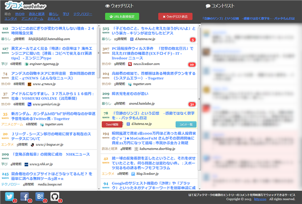
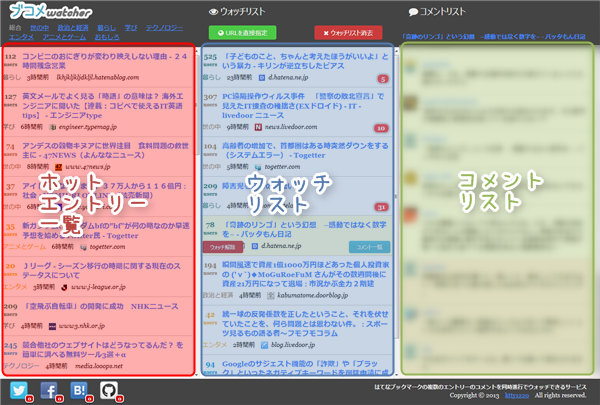
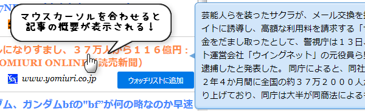
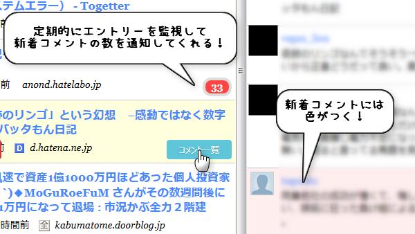

# ブコメwatcher - はてなブックマーク コメント追っかけサービス

はてなブックマークの複数のエントリーのコメントを同時進行でウォッチできるサービス「[ブコメwatcher](http://bucome-watcher.herokuapp.com/)」ソースです。

[Backbone.js](http://backbonejs.org/)と[CoffeeScript](http://coffeescript.org/)をメインに構成されており、サーバーサイドでの処理は一切ありません。したがって、当プロジェクトをcloneもしくはダウンロードしてindex.htmlを開くだけでも使用できるようになっています。

(index.phpと.htaccessはherokuで静的ファイルをデプロイするのに必要なダミーファイルです)

## ブコメwatcherについて

3つのリストから構成されているサービスです。

### 左: [はてなブックマーク](http://b.hatena.ne.jp/)ホットエントリー一覧

はてなブックマークのホットエントリー一覧が表示されます。各エントリーにマウスカーソルを合わせると`ウォッチリストに追加`というボタンが表示されます。

このボタンを押すと中央のリスト(ウォッチリスト)にエントリーが追加されて、一定間隔で新着コメントがあるかどうかチェックします。

また、エントリーのタイトルにマウスカーソルを合わせると、記事の概要がツールチップで表示されます。

### 中央: ウォッチリスト

一定間隔で新着コメントをチェックする対象のエントリー一覧です。各エントリーにマウスカーソルを合わせると`コメント一覧`というボタンが表示されます。

このボタンを押すと右のリスト(コメントリスト)にそのエントリーについたコメントの一覧を見ることができます。

新着コメントがあった場合にはエントリーの右下に赤いマークで新着コメント数が表示されます。

### 右: コメントリスト

ウォッチリストで選択したエントリーのコメント一覧を表示します。新着コメントには色が付きます。

このように、Twitterのタイムラインのような感覚ではてなブックマークのコメントを見ることができます。

### ウオッチリストの情報保存先

ウォッチリストに登録したエントリーはブラウザのローカルストレージに保存されます。したがって一旦ブラウザを閉じて開き直したり、リロードしたりしてもウォッチリストの情報は消えません。

ウォッチリスト上部の`ウォッチリスト消去`ボタンを押すと登録されているウォッチリストとローカルストレージがクリアされます。

なお、ブラウザにデータを保存するため、デバイス間でのウォッチリストの共有はできません。

## ソース構成

jsディレクトリ内にはjsファイルとcoffeeファイルが混在しています。それらを1つにまとめたのが`app.js`です。

`app.js`は、プロジェクトのルートディレクトリにある`buildjs.coffee`を実行すると作成できます。

自分用に各種coffeeファイルをカスタマイズした場合などは`buildjs.coffee`を実行して`app.js`を作り直してください。

jsファイルはサードパーティのライブラリで、coffeeファイルはブコメwatcherのソースです。

### サードパーティのライブラリ

* [activity-indicator.js](http://neteye.github.io/activity-indicator.html)

    ローディング中のインジケーターを表示させるのに使用しています。

* [jquery.powertip.js](http://stevenbenner.github.io/jquery-powertip/)

    エントリーのタイトルにマウスカーソルを合わせた時にエントリー概要をツールチップ表示させるのに使用しています。

* [\_nicedate.js](http://d.hatena.ne.jp/piglovesyou/20111105/1320516029)

    Underscore.jsを拡張するライブラリです。各種日時を相対表示させるのに使用しています。

* [jquery.popn-socialbutton.coffee](https://github.com/ktty1220/jquery.popn-socialbutton)

    フッターに表示させるソーシャルボタンを表示するのに使用しています。

### ブコメwatcherのソース

* base-view.coffee

    主要3リストのベースとなるビュークラスです。Backbone.Viewを継承しています。

* entry-list.coffee

    はてなブックマークホットエントリー一覧リスト(左)に関するBackboneクラス群です。

* watch-list.coffee

    ウォッチリスト(中央)に関するBackboneクラス群です。

    entry-list.coffeeで定義したクラスを継承しています。

* comment-list.coffee

    コメントリスト(右)に関するBackboneクラス群です。 
    
* main.coffee

    DOMロード後に実行する処理です。各種リストのインスタンス化もここで行われます。

### その他CDNからロードしているライブラリ

* [Pure](http://purecss.io/)

    CSSフレームワークです。

* [FontAwesome](http://fortawesome.github.io/Font-Awesome/)

    アイコンフォントを表示するのに使用しています。

* [Backbone.js](http://backbonejs.org/)

    当プロジェクトの心臓部となるクライアントサイドのフレームワークライブラリです。

    また、Backbone.jsを使用するにあたり必要となる[Underscore.js](http://underscorejs.org/)、[json2.js](https://github.com/douglascrockford/JSON-js)、[jQuery](http://jquery.com/)もロードしています。

* [Underscore.string](http://epeli.github.io/underscore.string/)

    Underscore.jsを拡張するライブラリです。文字列操作などに使用しています(ほとんど使用していません)。

* [Google Feed API](https://developers.google.com/feed/v1/devguide?hl=ja)

    クロスドメインであるはてなブックマークのRSSを取得するのに使用しています。

## 対応ブラウザ

* モダンブラウザ
* IE8以上

ただしIE8では表示にあたり致命的ではないいくつかの問題があります。できるだけ最新のブラウザを使用することを推奨します。

なお、現段階はスマートフォンに適した表示には対応していません。マウスホバー時に実行されるイベントも多い為、タッチ型のデバイスでは快適には利用できないと思います。ご了承ください。

## Changelog

### 0.1.2 (2013-06-18)

* ホットエントリー取得失敗時にリトライできるようにした

### 0.1.1 (2013-06-17)

* jQuery POP'n SocialButtonを最新版に差し替え

### 0.1.0 (2013-06-14)

* 初版リリース

## ライセンス

[MIT license](http://www.opensource.org/licenses/mit-license)で配布します。

&copy; 2013 [ktty1220](mailto:ktty1220@gmail.com)
